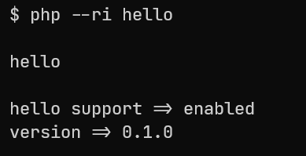
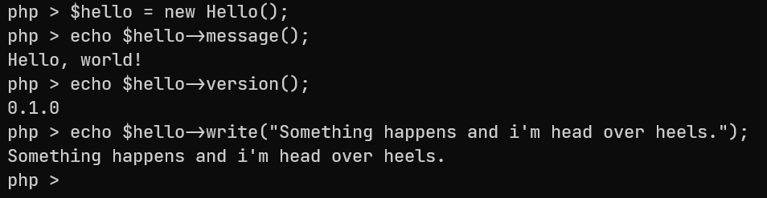
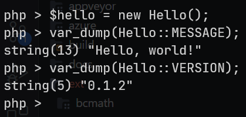
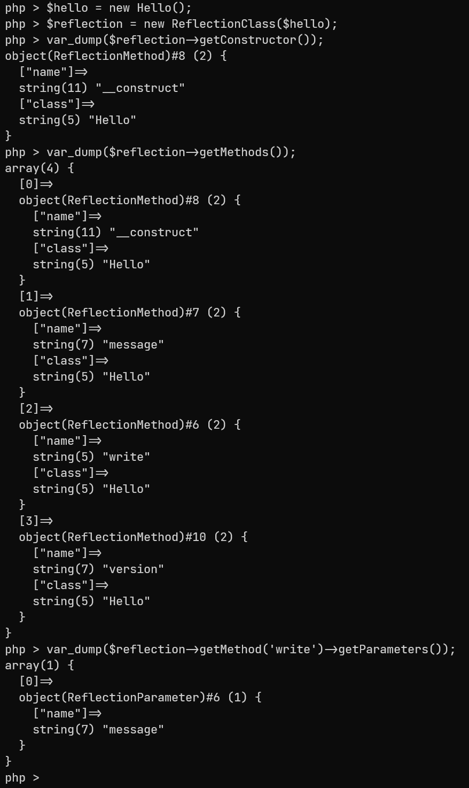

## 🐘 Hello PHP Extension
Repository for studies on creating and compiling PHP extensions.

### Requirements
- Windows 10/11 x64
- Visual Studio C++ >= 16
- PHP >= 8.1.0

### Checking

### Running

Calling methods

Constants

With Reflection API

